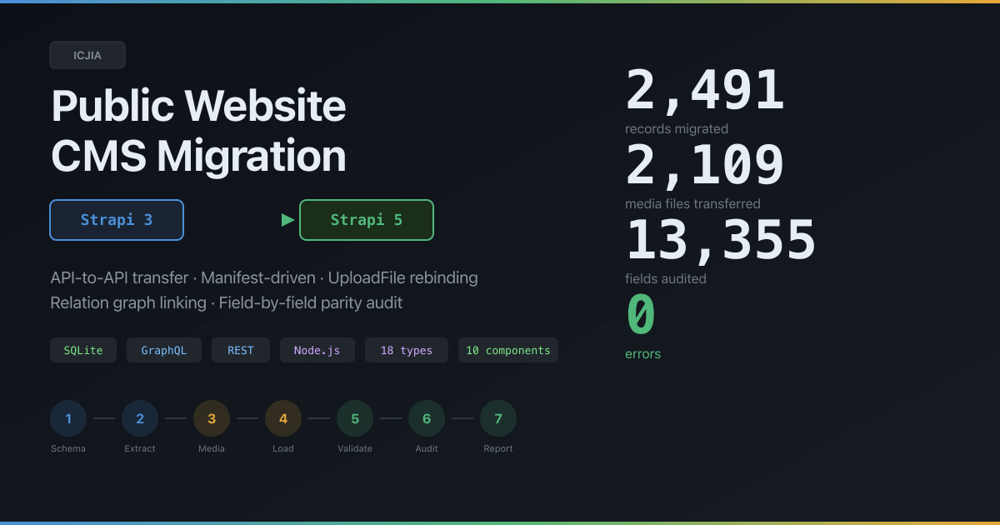
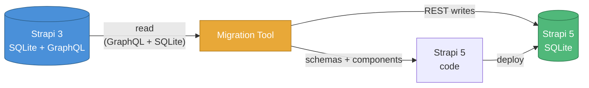
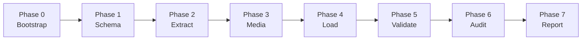

# ICJIA Public Website CMS Migration (Strapi 3 → Strapi 5)



API-to-API migration tool for moving the ICJIA public website (`agency.icjia-api.cloud`) from Strapi 3 (SQLite) to Strapi 5 (SQLite). Reads content from a Strapi 3 GraphQL endpoint (with direct SQLite fallback for drafts and access-restricted types), transforms and re-uploads media, then loads everything into a Strapi 5 instance with relation linking, timestamp preservation, and field-by-field parity verification.

**Project:** ICJIA Public Website CMS Migration
**Source:** Strapi 3 SQLite (`https://agency.icjia-api.cloud`)
**Target:** Strapi 5 SQLite
**Architecture:** Forked from the sibling tool [`icjia-hub-migration-tools`](https://github.com/ICJIA/icjia-hub-migration-tools) which migrated ResearchHub from Strapi 3 MongoDB → Strapi 5 SQLite (March 2026)
**Version:** 0.9.10 — see [CHANGELOG.md](CHANGELOG.md)

**Validated end-to-end:** 2,491 of 2,492 records loaded, 478 relation links created, 2,109 of 2,110 media files re-uploaded, 13,355 field comparisons with **0 ERROR-category findings** (13,259 OK + 96 EXPECTED transformations).

---

## Table of Contents

- [Why this exists](#why-this-exists)
- [Prerequisites](#prerequisites)
- [Quick start](#quick-start)
- [What gets migrated](#what-gets-migrated)
- [Architecture overview](#architecture-overview)
- [Phase pipeline](#phase-pipeline)
- [Configuration](#configuration)
- [Strapi 5 setup](#strapi-5-setup)
- [Running the migration](#running-the-migration)
- [Incremental updates after the first migration](#incremental-updates-after-the-first-migration)
- [Verification &amp; validation](#verification--validation)
- [Deploying to production](#deploying-to-production)
- [Repository layout](#repository-layout)
- [Source data reference](#source-data-reference)
- [Troubleshooting](#troubleshooting)
- [Migration plan](#migration-plan)
- [License](#license)

---

## Why this exists

Strapi 3 has been end-of-life since 2022. The ICJIA public website's CMS needs to move to Strapi 5 with no data loss, preserving:

- All 17 modeled content types (~5,308 records, including drafts)
- 10 component definitions, including 3 with nested sub-components
- 2,110 uploaded files (re-hosted, not just URL-rewritten)
- Relation integrity across ~19 dominant m2m edges
- Timestamps within ±1 second of the source
- Embedded richtext URLs rewritten from absolute to relative
- The `Home` singleton's nested component structure (Carousel → Slide)

This tool is API-to-API: it reads via GraphQL and direct SQLite, writes via Strapi 5 REST. No raw DB-to-DB copy — that approach can't translate Strapi 3's schema/relation idioms to Strapi 5's `documentId`-based model.

---

## Prerequisites

- **Node.js 22** (see `.nvmrc`)
- **pnpm 10.30+** (`packageManager` in `package.json`)
- **sqlite3 CLI** for direct DB inspection (`brew install sqlite3` on macOS)
- A locally running **Strapi 5** instance (created separately; see [Strapi 5 setup](#strapi-5-setup))
- Read access to `https://agency.icjia-api.cloud/graphql` (no auth required for v1 scope)
- A copy of the Strapi 3 source materials at `docs/strapi-3-source/`:
  - `api/<type>/models/*.settings.json` — content type definitions
  - `components/<category>/<name>.json` — component definitions
  - `data.db` — Strapi 3 SQLite database (gitignored — contains password hashes)
  - `config/security.json` — server config

---

## Quick start

```bash
# 1. Install
pnpm install

# 2. Pick a config profile
cp config.dev.js config.js          # local Strapi 5 on :1340
# OR
cp config.prod.js config.js         # production Strapi 5

# 3. Set the Strapi 5 API token (required for write phases)
export STRAPI5_TOKEN="..."          # generate in Strapi 5 admin → Settings → API Tokens

# 4. Run preflight to verify everything is ready
pnpm preflight                      # checks Node, deps, configs, source data,
                                    # Strapi 3 reachability, Strapi 5 server +
                                    # token validity. Prints PASS/FAIL/WARN
                                    # table with actionable guidance.

# 5. Run the full pipeline (preflight → phases 1-7 → postflight)
pnpm migrate:full

# Or resume from a specific stage if you've run partway already:
pnpm migrate:full --start-from=phase04
pnpm migrate:full --skip=phase07

# Or run individual phases (recommended for first run)
pnpm migrate:phase01                # schema setup
pnpm migrate:phase02                # extract from Strapi 3
pnpm migrate:phase03                # download + re-upload media
pnpm migrate:phase04                # load + link relations
pnpm migrate:phase05                # validate
pnpm migrate:phase06                # parity audit
pnpm report                         # HTML + DOCX migration report

# 6. Run postflight for final sign-off
pnpm postflight                     # runs preflight + validate + audit + report,
                                    # aggregates final stats: records by type,
                                    # field comparisons, ERROR/EXPECTED/INFO/OK
                                    # parity counts, sign-off-ready summary.
```

**Preflight options:**

```bash
pnpm preflight --skip-strapi5       # skip Strapi 5 checks (before S5 is set up)
pnpm preflight --json               # JSON-only output (for CI)

# Custom Strapi 5 port (default :1340):
STRAPI5_API_URL=http://localhost:1339 pnpm preflight
```

**Postflight options:**

```bash
pnpm postflight --skip-report       # faster; skip Phase 7 HTML/DOCX
pnpm postflight --json              # JSON-only output (for CI)
```

---

## What gets migrated

Sourced from `migration/config/content-types.json` (the central manifest).

| Type | Records | Drafts | Notes |
|---|---|---|---|
| Publication | 1139 | 32 | `tags` is JSON array (preserved literally) |
| Meeting | 283 | 2 | `external` array of components |
| Job | 231 | 13 | `external` array of components |
| Form | 205 | 0 | `form` JSON field — preserved verbatim |
| Post | 190 | 5 | Dominant on 4 relations |
| Biography | 138 | 0 | `headshot` UploadFile; m2o → unit |
| Grant | 115 | 0 | Dominant on 4 relations |
| Program | 65 | 0 | Dominant on 2 relations |
| Page | 38 | 0 | `clickthrough` array of components |
| Tag | 27 | 0 | Inverse side of all 9 m2m relations |
| RequiredForm | 21 | 0 | `tags` relation fixed during migration |
| Unit | 11 | 0 | Dominant on tags |
| Policy | 9 | 0 | `tags` relation fixed during migration |
| Rule | 7 | 0 | citation + citationURL |
| Event | 6 | 0 | Dominant on 3 relations |
| Config | 4 | 0 | Opaque JSON in `config` field |
| Regulation | 2 | 0 | url + summary |
| **Home** (singleType) | 1 | 0 | Nested ComponentCarousel → ComponentSlide |
| ~~Build~~ | 0 | — | Skipped in v1 (empty source) |

**Plus:**
- 10 component types (`carousel`, `slide`, `clickthrough`, `banner`, `external-url`, `button`, `menu-item`, `slider-button`, `countdown`, `add-event`)
- 2,110 upload-file records
- ~19 dominant m2m relation edges

**Explicitly excluded** (orphan tables in source DB without `.settings.json` models): `pubs` (1029), `funding-opportunities` (34), `documents` (0), `site-configs` (1), `context-menus` (1).

---

## Architecture overview



The tool itself is a thin orchestration layer over a small set of generic libraries. Heavy lifting (HTTP clients, schema generation, relation linking, parity audit, DOCX/HTML reports) is shared with the sibling tool.

---

## Phase pipeline



| Phase | Command | What happens |
|---|---|---|
| 0 — Bootstrap | (manual setup) | Repo layout, `.gitignore`, configs, content-types manifest. **Done — this commit.** |
| 1 — Schema | `pnpm migrate:phase01` | Read `.settings.json` + introspect SQLite, generate Strapi 5 content types + components, copy to S5 project, verify |
| 2 — Extract | `pnpm migrate:phase02` | Pull all records via GraphQL (or SQLite for drafts/Form) into JSON files in `migration/data/raw/` |
| 3 — Media | `pnpm migrate:phase03` | Download UploadFiles from `agency.icjia-api.cloud/uploads/`, re-upload via S5 `/api/upload`, rewrite richtext body URLs |
| 4 — Load | `pnpm migrate:phase04` | POST records to S5, link m2m relations (n-pass dominant-side), publish non-drafts, restore timestamps |
| 5 — Validate | `pnpm migrate:phase05` | 10 automated checks (counts, drafts, media, relations, timestamps, content) |
| 6 — Audit | `pnpm audit` | Field-by-field parity report (ERROR / EXPECTED / INFO / OK) |
| 7 — Report | `pnpm report` | HTML + DOCX migration report for stakeholders |

Reset/cleanup utilities:

| Command | Purpose |
|---|---|
| `pnpm migrate:clean` | Wipe `migration/data/` and `migration/output/` (no DB writes) |
| `pnpm reset` | Reset local Strapi 5 (drops all migrated content) |
| `pnpm migrate:reset` | Reset remote Strapi 5 via SSH |
| `pnpm set-strapi5` | Interactively switch Strapi 5 URL between dev/prod |

---

## Configuration

Three config files at the repo root:

| File | Purpose |
|---|---|
| `config.example.js` | Annotated reference. Default fallback when no `config.js` exists. |
| `config.dev.js` | Local dev profile: remote Strapi 3, local Strapi 5 (`localhost:1340`) |
| `config.prod.js` | Production profile: remote Strapi 3, remote Strapi 5 |

To activate a profile:

```bash
cp config.dev.js config.js     # config.js is gitignored
# or
MIGRATION_ENV=dev pnpm migrate:phase02
```

Resolution order: `config.js` → `config.${MIGRATION_ENV}.js` → `config.example.js`.

### Environment variables

| Var | Default | Purpose |
|---|---|---|
| `STRAPI3_GRAPHQL_URL` | `https://agency.icjia-api.cloud/graphql` | Strapi 3 GraphQL endpoint |
| `STRAPI3_API_URL` | `https://agency.icjia-api.cloud` | Strapi 3 REST base (count endpoints, file URLs) |
| `STRAPI3_TOKEN` | `''` | Optional auth token for Strapi 3 |
| `STRAPI3_SQLITE_PATH` | `./docs/strapi-3-source/data.db` | Path to in-repo Strapi 3 SQLite snapshot |
| `STRAPI5_GRAPHQL_URL` | `http://localhost:1340/graphql` | Strapi 5 GraphQL endpoint |
| `STRAPI5_API_URL` | `http://localhost:1340` | Strapi 5 REST base |
| `STRAPI5_TOKEN` | — | **Required** for write phases. Generate in S5 admin → Settings → API Tokens |
| `STRAPI5_DB_PATH` | `../icjia-public-strapi5/.tmp/data.db` | Strapi 5 SQLite path for timestamp restoration |
| `STRAPI5_PROJECT_PATH` | `../icjia-public-strapi5` | Strapi 5 project dir for schema copy |
| `MIGRATION_ENV` | — | `dev` or `prod` to select a profile without copying |

### Central content-types manifest

`migration/config/content-types.json` is the single source of truth for what to migrate. Each entry declares:

```json
{
  "name": "post",
  "kind": "collectionType",
  "queryName": "posts",
  "sqlTable": "posts",
  "draftAndPublish": true,
  "hasDrafts": true,
  "skipDefault": false,
  "hasComponents": false,
  "dominantRelations": ["tags", "meetings", "programs", "biographies"],
  "componentFields": [],
  "notes": "..."
}
```

Edit this file to scope the migration (add types, skip types, change dominance). All downstream phases read from it.

---

## Strapi 5 setup

The migration tool expects a fresh Strapi 5 install at the path given by `STRAPI5_PROJECT_PATH` (default `../icjia-public-strapi5`). **Install in JavaScript mode**, not TypeScript — the migration tool's generated boilerplate is JS, and a JS Strapi 5 project loads them natively without compilation.

### One-time install (automated)

The fastest, most reliable path:

```bash
cd /Volumes/satechi/webdev/icjia-migration-tools
./install-strapi5.sh                  # local dev (port 1340)
./install-strapi5.sh --port=5150      # custom port (e.g., for prod)
./install-strapi5.sh --target=/path   # custom directory
./install-strapi5.sh --force          # skip the "wipe existing dir" prompt
```

The script does everything except the browser-based admin user + API token creation. It:

1. Validates Node 22+ and pnpm
2. **Wipes the migration tool's working state** (`migration/data/`, `migration/output/`, `migration/config/field-map.json`) — true Phase 0 fresh start. Pass `--keep-migration-data` to preserve cached extracts and downloaded media.
3. Wipes any existing `icjia-public-strapi5/` directory (with confirmation; `--force` to skip)
4. Runs `create-strapi-app@latest` with `--javascript`, `--no-run`, etc.
5. Sets `PORT` in `.env`
6. Installs `@strapi/plugin-graphql`
7. **Builds native bindings** (writes `pnpm.onlyBuiltDependencies` allowlist to package.json + runs `pnpm install`; the step pnpm 10+ blocks by default — most common first-time error)
8. Verifies `better_sqlite3.node` exists; falls back to `node-gyp rebuild` if not
9. Prints clear next-steps for the manual bits (admin user, token, paste into config.js)

When it finishes, follow the printed next-steps and you're ready to run `pnpm migrate:full`.

### One-time install (manual / verbose)

If you'd rather run each command yourself:

> **Critical:** the steps below must run in this exact order. The
> `pnpm rebuild` step is **mandatory** — without it, Strapi 5 will fail to
> start with `Could not locate the bindings file` because pnpm 10+ blocks
> native build scripts (`better-sqlite3`, `sharp`) by default.

```bash
# ──────────────────────────────────────────────────────────────────
# 1. Create the JS Strapi 5 project (sibling directory)
# ──────────────────────────────────────────────────────────────────
cd /Volumes/satechi/webdev    # parent of this repo
npx create-strapi-app@latest icjia-public-strapi5 \
  --quickstart --no-run --skip-cloud --skip-db \
  --javascript

# When the installer asks:
# - Database client → SQLite (default)
# - Skip admin user creation prompt — we'll create it via the UI

# ──────────────────────────────────────────────────────────────────
# 2. Configure port
# ──────────────────────────────────────────────────────────────────
cd icjia-public-strapi5
echo "PORT=1340" >> .env       # or 5150 for prod (see "Custom port" below)

# ──────────────────────────────────────────────────────────────────
# 3. Install GraphQL plugin (required for Phase 1c verification)
# ──────────────────────────────────────────────────────────────────
pnpm add @strapi/plugin-graphql

# ──────────────────────────────────────────────────────────────────
# 4. Build native bindings (MANDATORY — Strapi will not start without this)
# ──────────────────────────────────────────────────────────────────
# pnpm 10+ blocks build scripts by default for security. Strapi needs
# better-sqlite3 (database driver) and sharp (image processor) to have
# their native .node binaries built before the server can launch.
pnpm rebuild better-sqlite3 sharp

# Alternative interactive path (lets you review/approve each script):
#   pnpm approve-builds
# (then select better-sqlite3 + sharp + esbuild + @swc/core + core-js-pure
#  + @apollo/protobufjs and confirm)

# ──────────────────────────────────────────────────────────────────
# 5. First launch
# ──────────────────────────────────────────────────────────────────
pnpm develop
# Wait for: "Strapi started successfully"
# If you see "Could not locate the bindings file", step 4 didn't run —
# Ctrl+C, run `pnpm rebuild better-sqlite3 sharp`, then `pnpm develop` again.
```

Then in the browser (auto-opens, or visit `http://localhost:1340/admin`):

1. **Create the admin user** via the first-launch wizard.
2. Settings (gear icon) → **Global Settings → API Tokens** → **+ Create new API Token**:
   - Name: `migration`
   - Description: `Migration tool — Phase 4 write access`
   - Token duration: `Unlimited`
   - **Token type: `Full access`** ← critical; "Read-only" tokens cannot create records
3. **Copy the token immediately** — Strapi only displays it once at creation time.
4. Set the token in this repo's `config.js` (preferred) or as an env var:
   ```bash
   # Option A: edit config.js — strapi5.token = '...'  (config.js is gitignored)
   # Option B: export STRAPI5_TOKEN="<paste-here>"  (per-shell only)
   ```

Phase 1 of this migration tool will write content-type and component schemas into `<STRAPI5_PROJECT_PATH>/src/api/` and `<STRAPI5_PROJECT_PATH>/src/components/`. Strapi 5 in dev mode auto-detects the file changes and reloads — no manual restart required after Phase 1.

### Adding the GraphQL plugin to an existing install

If you already have a Strapi 5 install without `@strapi/plugin-graphql`:

```bash
cd /Volumes/satechi/webdev/icjia-public-strapi5
pnpm add @strapi/plugin-graphql
# Stop Strapi 5 (Ctrl+C in its terminal) then:
pnpm develop
```

The plugin is auto-discovered — no config changes needed.

### Production hostname

The production Strapi 5 will be served at **`https://v2.agency.icjia-api.cloud`**. That hostname is already wired into `config.prod.js` (`strapi5.graphqlUrl` and `strapi5.apiUrl`). When you're ready to migrate to prod, just `cp config.prod.js config.js`, set `STRAPI5_TOKEN` for the prod instance, and run the phases.

If you ever change the hostname, edit `config.prod.js`:

```js
strapi5: {
  graphqlUrl: 'https://YOUR-NEW-HOSTNAME/graphql',
  apiUrl: 'https://YOUR-NEW-HOSTNAME',
  // ...
}
```

### Custom port (e.g., if prod already has another Strapi on :1340)

Three places to change. All three must agree.

**ICJIA's chosen prod port is `5150`** (since the prod server already has another Strapi on `:1340`). The migration tool talks to `https://v2.agency.icjia-api.cloud` (port 443/HTTPS); nginx forwards to internal `localhost:5150`. From the tool's perspective the port is invisible.

Examples below use 5150 as the **internal** Strapi 5 port.

**1. Strapi 5's port** — set in the Strapi 5 install's `.env`:

```bash
# In <STRAPI5_PROJECT_PATH>/.env (e.g., /var/www/icjia-public-strapi5/.env)
PORT=5150
```

Restart Strapi 5 for it to pick this up.

**2. Migration tool's URL config** — update one of:

- **Edit `config.prod.js` directly** (preferred for persistent prod config — it's the file you `cp` to `config.js` for prod runs):
  ```js
  strapi5: {
    graphqlUrl: 'https://v2.agency.icjia-api.cloud:5150/graphql',
    apiUrl: 'https://v2.agency.icjia-api.cloud:5150',
    // ... or use port 443 + reverse proxy — see option 3 below
  },
  ```
- **Or set environment variables** (per-shell — useful for ad-hoc runs):
  ```bash
  export STRAPI5_API_URL="http://localhost:5150"
  export STRAPI5_GRAPHQL_URL="http://localhost:5150/graphql"
  pnpm preflight
  ```

**3. Reverse-proxy (if applicable)** — production typically has nginx or
similar fronting Strapi 5. Two patterns:

- **Use the public proxy URL** (recommended): point the migration tool at
  `https://prod-domain.icjia-api.cloud` (port 443/HTTPS) and let the proxy
  forward to the internal Strapi port. The internal `PORT=1338` is invisible
  to the migration tool.
  ```js
  strapi5: { apiUrl: 'https://v2.agency.icjia-api.cloud', /* ... */ }
  ```
- **Bypass the proxy** (less common): point directly at the host:port
  combination — works only when the migration runs from inside the same
  network. For ICJIA's prod (port 5150), this might look like
  `http://internal-ip:5150` from the migration server.

**Quick sanity check** — after changing any of the three, run `pnpm preflight`
and confirm the "Server reachable" + "API token valid" rows are green. The
preflight target URL is the one in `config.js` (or the override env var).

### Choosing JavaScript vs TypeScript

This migration tool generates **JavaScript** boilerplate (CommonJS) for the Strapi 5 project. Two implications:

- **Recommended:** create the Strapi 5 project with `--javascript`. The `.js` files we generate load natively, no compile step, fastest iteration.
- **If you must use TypeScript:** the migration tool detects `tsconfig.json` and writes `.ts` boilerplate to match. But the schema generator must round-trip through `tsc` for routes to register — slightly slower; not recommended for first-time runs.

---

## Running the migration

### Full pipeline

```bash
pnpm migrate:full
```

Runs phases 1 through 6 sequentially. Exits non-zero on any phase failure. Safe to re-run — every phase is idempotent.

### Per-phase development loop

For initial development and debugging, run phases individually:

```bash
pnpm migrate:phase01    # generate schemas → restart Strapi 5 manually after this
pnpm migrate:phase02    # extract data
pnpm migrate:phase03    # process media
pnpm migrate:phase04    # load + link
pnpm migrate:phase05    # validate
pnpm audit              # parity audit (Phase 6)
pnpm report             # HTML + DOCX (Phase 7)
```

Each `pnpm migrate:phaseXX` is an **orchestrator** (`XX-run-phase.js`) that runs all the sub-scripts for that phase in order, with a connectivity check at the start and a `Next: pnpm migrate:phase(XX+1)` pointer at the end. Users normally don't need to invoke individual sub-scripts (`01a-introspect.js`, `03c-upload-media.js`, etc.) — those exist for granular debugging and re-runs.

### Idempotency &amp; failure recovery

Every phase is safe to re-run, but the strategies differ:

| Phase | If a script fails... |
|---|---|
| 0–1 (clean, schema) | Just re-run the whole phase. Fast. |
| 2 (extract) | Re-extract the affected content type — JSON files are written per-type, so other types' progress is preserved. |
| 3 (media) | Resumes automatically. Files already on disk are skipped (filesystem hash dedup). Files already uploaded to S5 are skipped (`uploadfile-manifest.json` map). Only the failed file is retried. |
| 4 (load) | Resumes automatically via `legacyId` lookup — records already in S5 are skipped. Re-running Phase 4 on a complete S5 reports "0 created, all skipped." |
| 5–7 (validate, audit, report) | Read-only. Just re-run. |

**The principle:** slow operations (downloads, uploads, large data writes) checkpoint via filesystem and `legacyId` so they can resume from the failure point. Fast operations (config reads, schema gen, validation) are designed to be re-runnable from scratch — no checkpoint state to maintain. If a script fails, fix the issue and re-run that phase; the tool figures out what's already done.

### Useful sub-commands

```bash
pnpm introspect         # just introspect the source schema (Phase 1a)
pnpm generate           # just generate Strapi 5 schemas (Phase 1b)
pnpm verify             # verify Strapi 5 schemas match expectations (Phase 1c)
pnpm extract            # just extract content (Phase 2)
pnpm validate           # re-run validation against current S5 state
pnpm fix-timestamps     # re-run timestamp fix (uses SSH for remote)
pnpm fix-image-refs     # re-run reference-style image rewriting
```

### Re-running a single content type

The phase scripts accept a `--type=<name>` filter:

```bash
pnpm migrate:phase02 -- --type=publication
pnpm migrate:phase04 -- --type=tag
```

---

## Incremental updates after the first migration

After the initial migration completes, editorial changes will keep happening in Strapi 3 until the public site cuts over. The migration tool supports incremental sync to keep Strapi 5 caught up. Every phase is **idempotent** — already-migrated records skip via `legacyId` lookup, already-downloaded files skip via filesystem hash, already-uploaded media skip via the hash → S5 ID map.

### Three update modes

| Mode | Flag | What it does | When to use |
|---|---|---|---|
| **Insert-only** (default) | _(no flag)_ | New records (legacyId not in S5) get POSTed; existing records skip. Safe and fast. | Regular incremental sync; you only added new content in Strapi 3. |
| **Update newer** | `--update-newer` | New records POSTed; **existing records PUT** if source `updated_at` is newer than the last sync timestamp. | Cutover-window sync — captures both new content AND edits to existing records since last run. |
| **Update existing** | `--update-existing` | New records POSTed; **every existing record PUT** unconditionally. Heavy. | One-off forced re-sync — useful if you need to re-apply schema changes or fix a corrupted destination. |

Mode selection is mutually exclusive — pass at most one of `--update-newer` or `--update-existing`.

### How `--update-newer` works

Each per-type ID map (`migration/data/maps/<plural>.json`) stores a `lastSyncedAt` ISO timestamp on every record entry. On `--update-newer` runs, the loader compares the source's `updated_at` against this stored timestamp:

- `source.updated_at > lastSyncedAt` → PUT to Strapi 5 + bump `lastSyncedAt`
- `source.updated_at <= lastSyncedAt` → skip (nothing changed since last sync)

The first run after upgrading to v0.8.0 will treat every record as "newer" (since `lastSyncedAt` was empty). After that first sync, only genuine edits trigger a PUT.

The PUT goes to `/api/<plural>/<documentId>` — Strapi 5's `documentId` for the existing record is read from the same map, so we never re-resolve by `legacyId` on every run.

### Running it via `update.sh` (recommended)

```bash
# 1. Pick a target
./update.sh --target=local              # talks to config.dev.js's Strapi 5
./update.sh --target=prod               # talks to config.prod.js's Strapi 5

# 2. Add update mode if you want changes from Strapi 3 to flow through:
./update.sh --target=prod --update-newer       # safe, recommended
./update.sh --target=prod --update-existing    # nuclear; rarely needed

# 3. Skip parts of the pipeline if you know they won't change:
./update.sh --target=local --skip-media        # no new media expected
./update.sh --target=local --skip-timestamps   # don't bother re-applying source timestamps

# Combine flags freely:
./update.sh --target=prod --update-newer --skip-timestamps
```

What `update.sh` does step-by-step:
1. **Activates `config.<target>.js`** — copies it to `config.js` (which is what every phase script reads). Any pre-existing `config.js` is backed up to `config.js.backup` first.
2. **Validates the destination** — for `--target=local`, checks `<strapi5ProjectPath>` exists on disk; for both, runs `pnpm preflight` and **fails fast** with a specific fix hint if Strapi 5 isn't reachable or the API token isn't Full Access.
3. **Phase 2 (extract)** — pulls fresh data from Strapi 3 GraphQL with `--force` so cached extracts are refreshed.
4. **Phase 3 (media)** — collects → downloads → uploads → rewrites. Files on disk skip download; files in the upload map skip re-upload; if your `--skip-media` flag is set, the whole phase is bypassed.
5. **Phase 4 step 1 (load)** — applies whichever update mode you picked.
6. **Phase 4 step 2 (link-relations)** — Strapi 5's `connect` syntax is idempotent; reconnecting an existing relation is a no-op.
7. **Phase 4 step 3 (timestamps)** — interactive prompt: "Type yes once Strapi 5 is stopped." This step needs exclusive write access to Strapi 5's SQLite. Skip with `--skip-timestamps` if you're OK with migration-time stamps for newly-loaded records.
8. **Phases 5–7** — re-runs validation, audit, and report so you have fresh artifacts.

### Running individual phases manually

If you want finer control, the underlying load script accepts the same flags:

```bash
# Update only one type, only modified records
node migration/scripts/04-load.js --type=post --update-newer

# Force-update one specific type (e.g., re-apply a schema change)
node migration/scripts/04-load.js --type=biography --update-existing

# Surgical fix — re-apply one type's body URL rewrites
node migration/scripts/04-load.js --type=page --update-existing
```

`--type` and update-mode flags compose freely. `--update-existing` without `--type` will PUT every record across every collection type, which can take a while — narrow it with `--type` whenever possible.

### Choosing between `--update-newer` and `--update-existing`

| Scenario | Flag |
|---|---|
| Cutover window — pick up editorial changes daily | `--update-newer` |
| You changed the body URL rewriter and want it re-applied to all records | `--update-existing --type=<type>` per affected type |
| You changed `content-types.json` dominance for a relation and want the new field shape pushed | `--update-existing --type=<type>` for the dominant side |
| Strapi 5 destination got corrupted, partial wipe — re-load only what's missing | _(no flag — default insert-only resumes via `legacyId`)_ |
| You added a brand-new content type to the manifest after the first migration | _(no flag — only that type's records are new, so insert-only handles it)_ |

### Recommended cutover playbook

| When | Command | Why |
|---|---|---|
| Cutover day −7 to −1 | `./update.sh --target=prod --update-newer` daily | Capture editorial changes as they happen; keeps the diff window small. |
| Cutover day 0 (final sync, before flipping the frontend) | `./update.sh --target=prod --update-newer` | One last sync immediately before the public site switches. |
| Cutover day 0 (after flipping) | _(stop running update.sh)_ | Strapi 5 is now the source of truth. Continued Strapi 3 edits are effectively orphaned. |
| Post-cutover | _(retire Strapi 3 after a holdout period)_ | Keep Strapi 3 read-only and reachable for a few weeks in case rollback is needed. |

You can automate the daily cutover-week sync as a cron job on the prod server:

```cron
# /etc/cron.d/icjia-migration-sync (cutover week only)
0 2 * * * www-data cd /var/www/icjia-migration-tools && ./update.sh --target=prod --update-newer --skip-timestamps >> /var/log/icjia-sync.log 2>&1
```

`--skip-timestamps` is recommended for cron because Phase 4c is interactive (prompts you to stop Strapi 5). Run a manual `./update.sh --target=prod --update-newer` _without_ `--skip-timestamps` once before cutover so timestamps are applied; daily cron syncs after that point only need fresh content, not perfect ±1s timestamps.

### What `update.sh` does **not** do (by design)

- **Delete records from Strapi 5** that were deleted in Strapi 3. This is intentional — accidental Strapi 3 deletes during the cutover window shouldn't propagate. If you need to prune, do it manually in the Strapi 5 admin.
- **Resolve concurrent edits** between Strapi 3 and Strapi 5. With `--update-newer`, the source side always wins — any Strapi 5 edits since the last sync get overwritten. During cutover, treat Strapi 5 as read-only to avoid this.
- **Migrate records previously skipped** (e.g., `grant 357` if you deleted it from the local snapshot due to a data quality issue). The skip is encoded in the local data; remove the skip first if you want them migrated.
- **Ramp safely against rate limits.** If Strapi 3 rate-limits the GraphQL endpoint, Phase 2 fails. Tune `requestDelayMs` in `config.<target>.js` to throttle.

### Path handling

Both `install-strapi5.sh` and `update.sh` use absolute path resolution from `${BASH_SOURCE[0]}`, so they work from any working directory. Examples:

```bash
# From your home directory:
~/icjia-migration-tools/install-strapi5.sh

# Via absolute path (typical on a prod server):
/var/www/icjia-migration-tools/update.sh --target=prod

# Or cd into the repo and run them locally:
cd /Volumes/satechi/webdev/icjia-migration-tools
./update.sh --target=local --update-newer
```

For prod, point `install-strapi5.sh` at the absolute install location explicitly — the default `--target` is the sibling directory `<repo>/../icjia-public-strapi5`, which is fine for local but probably not for `/var/www`:

```bash
# Prod-style install
/var/www/icjia-migration-tools/install-strapi5.sh \
  --target=/var/www/icjia-public-strapi5 \
  --port=5150
```

`update.sh` reads `strapi5ProjectPath` from the activated config, so you don't pass it on the command line — set it once in `config.prod.js` and it's used by every subsequent `update.sh --target=prod` invocation.

---

## Verification & validation

After Phase 5 (validate) you should see all 10 checks PASS:

1. Counts (incl. drafts) match between Strapi 3 SQLite and Strapi 5 REST
2. `legacyId` coverage — every source record maps to one S5 record
3. Draft preservation — drafts have `publishedAt: null` in S5
4. No Base64 remnants in body fields
5. Media migration — all 2,110 hashes uploaded
6. Media accessibility — all S5 upload URLs return HTTP 200
7. Relation integrity — every dominant edge spot-checked
8. Timestamps preserved within ±1s
9. Content integrity — 10% sample matches source
10. Component instance counts match

Phase 6 (audit) produces a per-record, per-field comparison categorized as:
- **OK** — perfect match
- **EXPECTED** — known transformation (UploadFile ID swap, body URL rewrite, etc.)
- **INFO** — non-critical divergence (e.g., `updatedAt` newer in S5 from post-migration timestamp fixes)
- **ERROR** — unexpected difference. **Target: 0**.

Outputs:
- `migration/data/validation-report.json`
- `migration/data/audit-report.json`
- `migration/data/audit-report.md`
- `migration/data/migration-report.html` (Phase 7)
- `migration/data/migration-report.docx` (Phase 7)

### Idempotency proof

Re-running Phase 4 on a populated Strapi 5 should produce **0 new records** — every source ID is already mapped via `legacyId`:

```bash
pnpm migrate:phase04
# Expect: "Skipped 5308 (legacyId already exists), Created 0"
```

---

## Deploying to production

Two viable paths to get the migrated content onto the production Strapi 5 instance. The plan and tooling are wired for **Option A**; Option B is documented as an alternative.

**Always migrate locally first** — regardless of which cutover path you take. The local migration pass is where you shake out schema bugs, validate counts, audit field-by-field parity, and review the audit-report.md with stakeholders. Don't run any phase against prod until `pnpm postflight` is green locally.

### Option A: API-to-API to remote prod (recommended)

Re-run the migration phases pointed at the production Strapi 5 instance. Same scripts, same idempotency — only the URLs change.

**Prerequisites:**
- Production Strapi 5 already deployed and reachable (this tool does not deploy Strapi 5 itself)
- A Full-Access API token created in production Strapi 5 admin
- SSH access to the prod server for Phase 4c (timestamp restoration via direct SQLite UPDATE — timestamps can't be set via REST)
- The same Strapi 5 version + Node version as your local install (so generated schemas behave identically)

**Procedure:**

```bash
# 1. Activate the production config profile
cp config.prod.js config.js

# 2. Edit config.prod.js (or set env vars) with the real prod values
#    - strapi5.graphqlUrl
#    - strapi5.apiUrl
#    - SSH details for 04c-fix-timestamps-remote.js
export STRAPI5_TOKEN="<prod-full-access-token>"

# 3. Run preflight against prod to confirm everything is reachable
pnpm preflight

# 4. (Recommended) start with phases 1 + 2 only against prod to validate
pnpm migrate:phase01    # generates schemas, copies to prod Strapi 5 src/
pnpm migrate:phase02    # extracts content (read-only on Strapi 3)

# 5. Run the rest
pnpm migrate:phase03    # download + upload media (slow — ~30–60 min on WAN)
pnpm migrate:phase04    # load + link relations + SSH timestamp fix

# 6. Final sign-off
pnpm postflight         # validate + audit + report against prod
```

**Tradeoffs:**
- Pro: Idempotent — if a network blip aborts a phase, re-run it. Files already uploaded (matched by hash) and records already loaded (matched by `legacyId`) are skipped.
- Pro: Each phase is independently verifiable against the running prod system.
- Pro: Same code path as dev — no special "production migration" mode to debug.
- Con: Slow — file uploads and record creates happen over WAN at the configured throttle (`requestDelayMs`).
- Con: Prod Strapi 5 is doing real work for hours; cache populates and search indexes update during the migration.

### Option B: Migrate locally, SFTP the result to prod

Run the full migration into a local Strapi 5. Once `pnpm postflight` is fully green, stop prod Strapi 5, rsync the local `.tmp/data.db` and `public/uploads/` into prod, and restart.

**Prerequisites:**
- Production Strapi 5 install with **identical** Strapi 5 version + Node version to your local install (otherwise SQLite document IDs or schema artifacts may not transfer cleanly)
- A scheduled maintenance window (5–15 minutes for the cutover itself)
- A tested rollback plan (e.g., snapshot of `data.db` + `public/uploads/` before swapping)
- SSH/SFTP access to the prod server

**Procedure:**

```bash
# 1. Migrate locally end-to-end against config.dev.js (already done)
pnpm postflight   # confirm green

# 2. (On prod) snapshot current state for rollback
ssh prod "cd /var/www/icjia-public-strapi5 && \
  cp .tmp/data.db .tmp/data.db.pre-migration && \
  tar czf public/uploads-pre-migration.tar.gz public/uploads/"

# 3. (On prod) stop Strapi 5
ssh prod "pm2 stop icjia-public-strapi5"

# 4. (Locally) rsync the migrated data.db and uploads
rsync -avz ../icjia-public-strapi5/.tmp/data.db \
  prod:/var/www/icjia-public-strapi5/.tmp/data.db
rsync -avz --delete ../icjia-public-strapi5/public/uploads/ \
  prod:/var/www/icjia-public-strapi5/public/uploads/

# 5. (On prod) restart Strapi 5 and smoke-test
ssh prod "pm2 start icjia-public-strapi5"
curl https://prod-host/api/posts?pagination[pageSize]=1
```

**Tradeoffs:**
- Pro: Cutover is one atomic rsync, ~5–15 minutes total.
- Pro: Production server is untouched until the moment of cutover.
- Pro: All migration work happens on local disk at full speed.
- Con: One-shot — once swapped, "fix and rerun" means restoring from snapshot, not re-running phases.
- Con: Local and prod Strapi/Node versions must match exactly.
- Con: No incremental sync option once cut over (the sibling's `pnpm sync` works only via Option A).

### Recommendation

Stick with **Option A** unless you have a hard reason for atomic cutover (e.g., a strict maintenance window, prod box CPU-constrained). Option A is the sibling tool's proven pattern, fully resumable, and easier to verify continuously. Option B is fine for a confident team with a tested cutover playbook.

For both paths, **never skip the local migration step** — that's where every issue is shaken out before touching prod.

---

## Repository layout

```
icjia-migration-tools/
├── README.md                              # this file
├── LICENSE                                # MIT
├── package.json
├── pnpm-workspace.yaml
├── .nvmrc                                 # Node 22
├── .gitignore                             # excludes data.db, node_modules, migration/data
├── config.example.js                      # annotated reference
├── config.dev.js                          # local dev profile
├── config.prod.js                         # production profile
├── deploy/
│   ├── ecosystem.config.cjs               # PM2 config (from sibling)
│   ├── nginx-strapi5.conf
│   └── restart.sh
├── docs/
│   ├── icjia-public-website-migration-plan.md       # full plan
│   ├── icjia-hub-migration-tools-*.txt              # sibling tool source dump (reference)
│   └── strapi-3-source/                             # source-of-truth Strapi 3 inputs
│       ├── api/<type>/models/*.settings.json        # 18 content types
│       ├── components/<category>/<name>.json        # 10 components
│       ├── config/security.json
│       └── data.db                                  # GITIGNORED — Strapi 3 SQLite snapshot
├── migration/
│   ├── config/
│   │   ├── content-types.json             # central manifest (the source of truth)
│   │   └── field-type-map.json            # type mappings + override rules
│   ├── lib/                               # generic, content-agnostic libraries
│   │   ├── graphql-client.js              # Strapi 3 read access
│   │   ├── rest-client.js                 # Strapi 5 write access
│   │   ├── load-config.js                 # config resolution
│   │   ├── schema-generator.js            # Strapi 3 → 5 schema conversion
│   │   ├── markdown-rewriter.js           # body URL + image rewriting
│   │   ├── base64-scanner.js              # detect inline Base64 (defensive)
│   │   └── base64-decoder.js              # decode Base64 with magic-byte check
│   └── scripts/                           # phase orchestration
│       ├── 00-clean.js
│       ├── 01-run-phase.js, 01a/01b/01c   # schema phase
│       ├── 02-run-phase.js, 02-extract.js, 02-verify.js
│       ├── 03-run-phase.js, 03a–03e       # media pipeline
│       ├── 04-run-phase.js, 04-load.js, 04b/04c/04d
│       ├── 05-run-phase.js, 05-validate.js
│       ├── 06-run-phase.js, 06-audit.js
│       ├── 07-sync.js                     # incremental sync (deferred)
│       ├── migrate-full.js                # runbook
│       └── reset-*.js, set-strapi5-url.js, fix-tables.js
└── (created at runtime)
    ├── migration/data/                    # extracted content, manifests, maps (gitignored)
    └── migration/output/                  # generated Strapi 5 schemas (gitignored)
```

---

## Source data reference

The `docs/strapi-3-source/` directory is your source-of-truth reference for what Strapi 3 looks like:

- **Content types:** `docs/strapi-3-source/api/<type>/models/<type>.settings.json`
- **Components:** `docs/strapi-3-source/components/<category>/<name>.json`
- **SQLite snapshot:** `docs/strapi-3-source/data.db` (gitignored)

Useful queries for development:

```bash
# Count records per type (incl. drafts)
sqlite3 docs/strapi-3-source/data.db "SELECT COUNT(*) FROM publications"

# List relation join tables
sqlite3 docs/strapi-3-source/data.db ".tables" | tr ' ' '\n' | grep -E '__|_components'

# Inspect the upload_file table (2,110 rows)
sqlite3 docs/strapi-3-source/data.db "SELECT id, name, hash, ext, size FROM upload_file LIMIT 10"

# Check dominance — which side's ID column comes first?
sqlite3 docs/strapi-3-source/data.db "PRAGMA table_info(events_tags__tags_events)"
```

---

## Troubleshooting

| Symptom | Likely cause | Fix |
|---|---|---|
| Phase 1 fails: "schema verification failed" | Strapi 5 not running, or schemas not yet copied | `cd $STRAPI5_PROJECT_PATH && pnpm develop`. Restart Strapi 5 after Phase 1 generates schemas. |
| Phase 2 fails: "GraphQL returned 403" | Restricted type (`Build`, `Form`) without auth | Form is auto-handled via SQLite. For Build, set `STRAPI3_TOKEN` or keep `skipDefault: true`. |
| Phase 3 fails: "ENOENT data.db" | `docs/strapi-3-source/data.db` is missing | Drop the Strapi 3 DB into `docs/strapi-3-source/`. It's gitignored, so each developer needs to obtain it separately. |
| Phase 4 fails: "Cannot link relations: 400" | Wrong dominance side in manifest | Check `dominantRelations[]` against `.settings.json`. Only the side with `dominant: true` can use `connect`. |
| Phase 4 fails on a singleton: "404 Not Found" | Single-type endpoint pattern | Singletons use `PUT /api/<singularName>` with no documentId. Ensure `home`'s `kind` is `singleType` in the manifest. |
| Phase 5 count check fails | Drafts not migrated, or `publicationState=preview` not set | Confirm `includeDrafts: true` in config and check `?publicationState=preview` is in the S5 query. |
| Phase 6 ERROR: body URL contains `agency.icjia-api.cloud` | richtext URL rewrite missed a record | Re-run `pnpm fix-image-refs` and the markdown rewriter unit tests. |
| Strapi 5 admin shows "Modified" status on records that should be Published | Phase 4b's PUT to attach relations updates the draft row only, leaving published row stale | Run `pnpm publish-all` (or re-run `pnpm migrate:phase04` to pick up the new 4b2-publish step). Drafts in source remain as drafts in S5. |
| `pnpm install` fails on `better-sqlite3` | Native build error | Ensure Node 22 (`.nvmrc`), Xcode CLI tools on macOS (`xcode-select --install`). |
| Strapi 5 fails to start with `Could not locate the bindings file` | pnpm 10+ blocks native build scripts by default; `better-sqlite3.node` was never compiled | `cd <STRAPI5_PROJECT_PATH> && pnpm rebuild better-sqlite3 sharp && pnpm develop`. This is the most common first-time setup error — see the "build native bindings" step in the install procedure. |

For deeper issues, the `audit-report.md` produced by Phase 6 lists every divergence with line-level detail.

---

## Migration plan

The full design plan lives at:

**[`docs/icjia-public-website-migration-plan.md`](docs/icjia-public-website-migration-plan.md)**

Sections include the full source content inventory, relation dominance matrix, file-by-file change list, day-by-day order of work, open risks, and a post-migration evolution roadmap (v1.1 schema cleanup + v2 Strapi-5-idiomatic redesign).

---

## License

[MIT](LICENSE) © 2026 Illinois Criminal Justice Information Authority (ICJIA)
